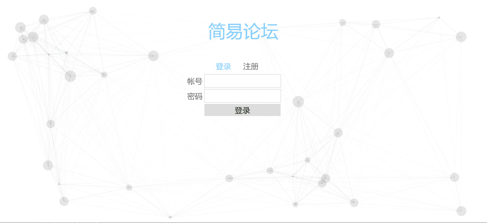
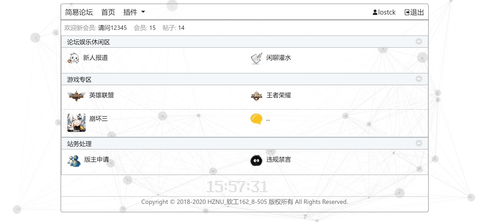
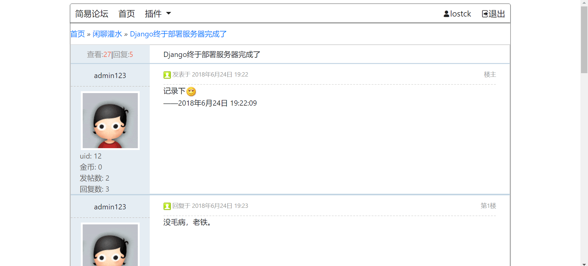
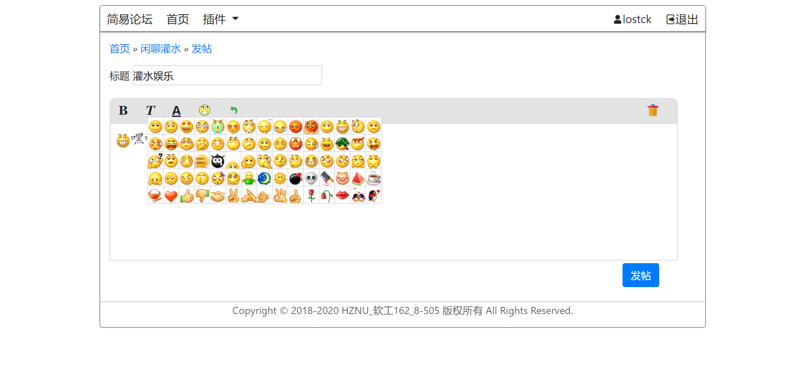
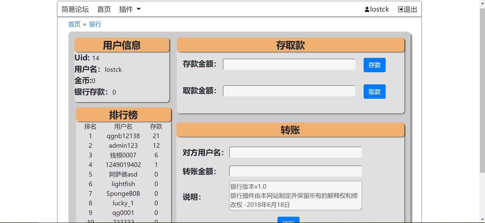

# 简易论坛
简易论坛:cloud:——大二下Web程序设计课自由命题大作业:boat:
### 设计初衷
从小爱逛各大论坛，如一些游戏论坛，分享游戏辅助之类的小论坛，平时也爱逛国内安全大牛出没的论坛吾爱破解。初中的时候在网上找过免费服务器，搭建过discuz和phpwind论坛，满足了自己成为站长可以无限改论坛币和置顶加红的乐趣，在管理员后台安装一些好玩的插件蛮有趣的。所以这次主题就定在自己搭建一个完整功能的简易论坛。

## 开发环境
IDE：PyCharm、Sublime Text 3  
语言：Python、Html5、Css、Javascript   
数据库：Mysql  
部署服务器环境：Apache24  
### 使用说明
> 本项目采用Django框架开发，故还需安装两个库、Django、mysqlclient
``` bash
pip install django
pip install mysqlclient
```
1.在mysql数据库手动创建forum数据库  
2.在forum/settings.py中DATABASES配置本地数据库帐号密码  
3.然后在PyCharm中导航栏Tools->Run manage.py Task...  
4.在打开的控制台输入如下命令创建数据表(其中app_name为空代表所有app,我这里为空)  
```
makemigrations app_name
migrate app_nage
```
5.登录mysql,导入板块名sql文件(在apps文件夹下的categoryname.sql)  
```
mysql> source categoryname.sql
```
6.在PyCharm中运行Django即可(或在工程目录下命令行运行`python manager.py runserver 0.0.0.0:8000`)  

## 论坛功能分类
  - [首页](#首页)：登录、注册  
  - [主页](#主页)：板块分类、导航栏的插件(银行)
  - [板块](#板块)：发帖、回复
  - [银行](#银行)：论坛币存款、转账、储蓄排行榜  
  
  > 其中登录、注册、发帖等操作均采用ajax异步式调用
  
**代码层次:**
```
        ├─apps                  //所有apps
        │  ├─bank               //银行插件   
        │  ├─category           //版块app  
        │  ├─user               //用户app  
        ├─forum                 //总工程配置   
        ├─static                //静态文件，包括js/css/img  
        └─templates             //存放html文件
```

# 成品截图
### 首页

### 主页

### 板块


### 银行


# 版权说明
  Copyright :copyright: 2018-2020 HZNU_软工162_8-505 版权所有 All Rights Reserved.  
[回到顶部](#简易论坛)
